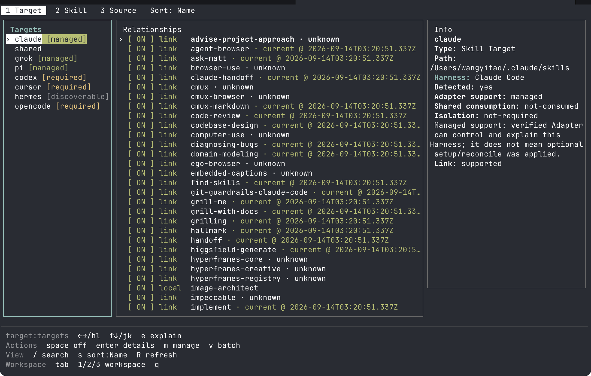
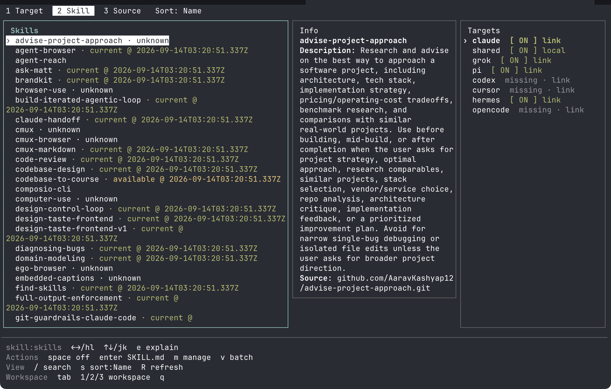
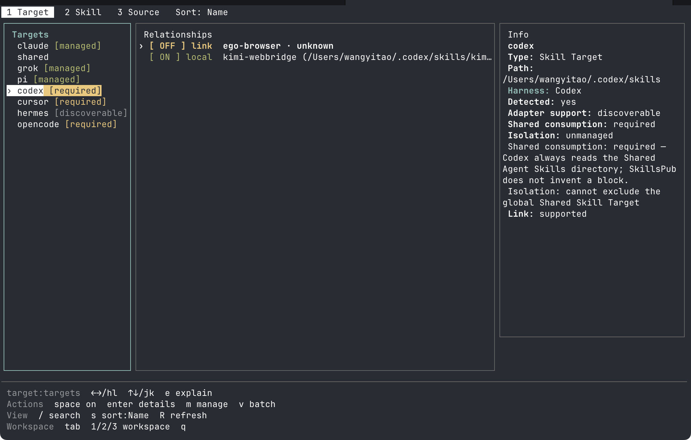
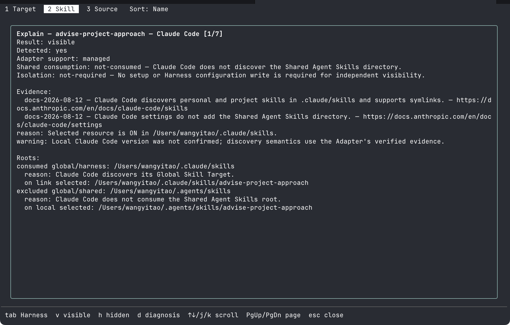

# SkillsPub

The skills switch matrix in your terminal.



*Target tab: every Skill Target, ON/OFF Relationships, and the bottom key area.*



*Skill tab: per-Target state, including `missing · link` cells you can create.*



*`[required]` Shared consumption — harnesses that always read the global Shared root, with no fake isolation.*



*`e` explain: next-load Effective visibility, Shared consumption, and contributing roots.*

SkillsPub turns Agent Skills on and off across AI coding harnesses from one
place. Open it and you get a skill × Target grid: what is on disk, which
harness will pick it up on next load, and which shared folders they still
read. Nothing is copied into a private vault first.

## Not a central catalog

Most skill managers collect copies into their own store, then dispatch them
out to each harness. SkillsPub does the opposite: it manages skills **where
they already live**.

- **In place.** ON means a skill directory or link sits in a Target discovery
  root (`~/.agents/skills`, `~/.pi/agent/skills`, `~/.claude/skills`, …). OFF
  parks it *outside* that root so scanners miss it. Off is not delete.
- **Disk is truth.** External tools, editors, and `npx skills` can move files.
The next scan is what happened. SkillsPub state stores intent (tags,
presets); it does not hold you hostage to that file. Throw the state away and
the switches are still on disk.
- **No background rewrite.** There is no watcher, daemon, or auto-reconcile.
  Changes wait for you.

## Two pillars

**Disk is truth, not a hostage.** SkillsPub never treats its own JSON as
actual on/off. If another tool changed the filesystem, the matrix shows that,
not a cached wish.

**Reading surfaces.** Harnesses do not all read the same folders. Claude Code
does not consume `~/.agents/skills`. Pi and Grok Build *can* isolate that
shared root, but only after an explicit setup. Turning off a harness-specific
Target does not hide a skill that still sits on a shared root another harness
reads. SkillsPub reports that **Shared consumption** instead of pretending a
per-harness off switch changed it. Some products have no official way to stop
reading the shared root; SkillsPub will not fake isolation for those.

## Install

Requires Node.js 22.20 or newer.

```sh
npm install --global skillspub
```

Or via [Homebrew](https://github.com/AlligatorT/homebrew-tap) (same SHA-256-verified npm tarball):

```sh
brew install AlligatorT/tap/skillspub   # upgrade: brew upgrade AlligatorT/tap/skillspub
```

Or without a global install: `npx skillspub targets`.

## Three minutes to the first switch

There is no setup step. SkillsPub discovers installed skills and harnesses by
scanning the disk.

```sh
skillspub
```

That opens the full-screen matrix (same as `skillspub tui`). Move with
`j`/`k` and `h`/`l`. `space` toggles an existing relationship. The bottom key
area lists the keys that apply to the current tab and focus. Link, unlink,
mirror, Source, and Harness writes still ask for a confirm.

The CLI prints the same grid:

```text
$ skillspub ls
skill      claude   shared   grok     pi
demo       ·        on       ·        on
notes      on       off      ·        ·
```

(`on` / `off` / `·` missing / `!` broken link)

```sh
skillspub off demo shared    # prints the plan, then parks it
skillspub on demo shared     # puts it back
skillspub explain demo       # next-load visibility + Shared consumption
```

Existing on/off applies after printing the plan. Creating a missing
relationship, Source/Harness writes, and `--json` stay dry until `--yes`.

Optional later — isolate Pi from the shared root (preview first):

```sh
skillspub harnesses
skillspub harnesses pi setup          # preview
skillspub harnesses pi setup --yes    # apply
```

Claude Code needs no setup. Grok Build isolation is the same `harnesses grok setup` path.

## Concepts

| Term | Meaning |
| --- | --- |
| **Disk is truth** | Actual state is the filesystem. SkillsPub state holds Base intent and Preset claims, not a second copy of on/off. |
| **Reading surface** | Which folders a harness actually consumes. Shared consumption is `not-consumed`, `required`, `enabled`, `excluded`, or `unknown`. |
| **Preset** | A persistent ON policy (skills, bundles, or tags). Presets never force OFF. Reconcile is explicit. |
| **Effective visibility** | For one installed skill and one harness: `visible`, `not-visible`, `unknown`, or `conflicted` on *next load* — not a running process. |

`skillspub explain <skill>` and `skillspub harnesses` are the reading-surface commands.

## Compatibility

Remote Source operations go through one pinned Vercel `skills` release
(`skills@1.5.21`), so release behavior does not drift with upstream `latest`.

Harness support levels are enforced by `npm run audit:release`. The
verified-version evidence each adapter was accepted against:

| Harness | Support | Verified against |
| --- | --- | --- |
| Pi | `managed` | v0.85.1 |
| Claude Code | `managed` | docs snapshot 2026-08-12 |
| Grok Build | `managed/excluded` | settings reference @ `19d42e35` |
| Codex | `discoverable` | 0.154.0 |
| Cursor | `discoverable` | docs snapshot 2026-09-10 |
| Hermes | `discoverable` | 0.21.3 |
| OpenCode | `discoverable` | v1.18.31 |

`discoverable` adapters report Shared consumption and carry no isolation claim.
Kimi Code and TraeCode remain observed only.

## TUI and CLI

`skillspub` in a terminal opens the keyboard-driven browser (`skillspub tui`;
add `--project [path]` for a project-scope view). Browse the skill × Target
matrix, read Shared consumption and Effective visibility (`e` explain), toggle
skills, manage Tags, Bundles, and Presets, and run the Source lifecycle (find,
add, update, remove). The bottom key area stays in view and regroups by context.

Everything the TUI does is also a scriptable command:

| Group | Commands |
| --- | --- |
| Inspect | `scan` · `ls` · `status <skill>` · `explain <skill>` · `targets` · `doctor` · `harnesses` |
| Toggle | `on\|off <selector> <target...>` |
| Organize | `tag` · `bundle` · `preset` |
| Sources | `shared find\|describe\|refresh\|outdated\|add\|update\|remove` |
| Harnesses | `harnesses [name inspect\|setup\|reconcile [--yes]]` |
| Project scope | prefix with `project <exact-path>` |

## Development

```sh
npm ci
npm run typecheck
npm test
npm run build
npm run audit:release
npm run check:package
npm pack --ignore-scripts
npm run check:package -- ./skillspub-0.2.0.tgz
npm pack --dry-run --ignore-scripts
```

`check:package` packs twice, verifies byte-for-byte deterministic tarballs
and the exact file allowlist, installs one tarball into a clean temporary
prefix, then runs the installed CLI and a read-only JSON command. Pass a
candidate tarball path to require a byte-for-byte match with the verified
package.

Release prerequisites and the cutover checklist are in
[`docs/releasing.md`](docs/releasing.md).

## License

MIT © 2026 AlligatorT
